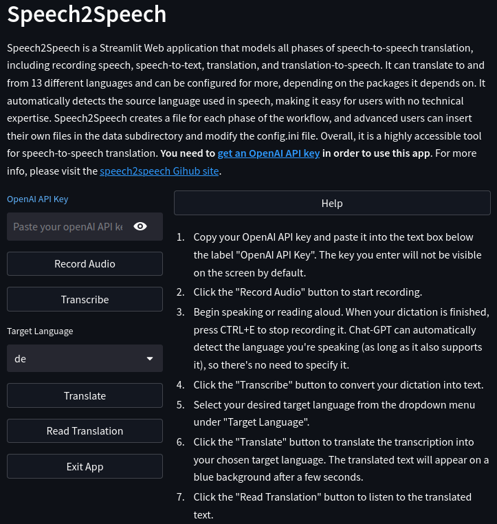

# Speech2Speech

The Speech2Speech Python package is a Streamlit Web application that **models 
all phases of speech-to-speech translation**, including:
- recording speech in the source language, 
- converting the source language speech to source language text, 
- translating the source language text to target language text, and 
- converting the translated text to speech in the target language. 

As a web application, it can be accessed through any web browser and is 
compatible with Linux, Mac, and Windows operating systems.

Speech2Speech is currently **configured to translate to and from 13 different 
languages**. Although the quality of  translation may vary depending on the 
target language, it is pretty good for popular languages such as English, 
French, Portuguese, Spanish, German, Dutch and Italian. Speech2Speech **can be 
configured for many more than just these languages** (specified in the config.
ini file), as long as they are supported by Whisper AI, Chat-GPT and gtts, 
the packages on which it depends.

The package **automatically detects the source language used in speech**. The 
user therefore is not asked to specify it.

Speech2Speech is designed to be accessible to a **broad audience**. One of 
the key advantages of Speech2Speech is that it's incredibly easy to use. 
There is **no need to train the software or the user before actually using 
the product**. It works well straight out of the box with no further tuning 
or configuration required. This makes it a highly accessible tool that anyone 
can use, regardless of their technical expertise or experience with speech  
recognition and machine translation technology. 

It is also hoped that this technology could be leveraged to develop 
products specifically designed for **persons with visual impairments**. It 
can empower them to have texts read aloud or dictate their texts 
and listen to them being read out loud before forwarding them to their 
intended recipients.

Each phase of the workflow creates a file, whose name is defined in the 
config.ini file. Advanced users can **start and/or interrupt the workflow 
wherever they need** by inserting their own files in the speech2speech/data 
subdirectory and adapting the config.ini file to refer to them. 

Prerequisites
-----------------------------------------------------------------------------
You need to [get an OpenAI API key](https://www.howtogeek.com/885918/how-to-get-an-openai-api-key/#autotoc_anchor_0) in order to use this app
   
Speech2Speech installation
--------------------------
To install Speech2Speech locally, open your terminal and run the following 
command:

    pip install speech2speech

Launch Speech2Speech
------------------------------------
Speech2Speech is a web app and you just need to enter its URL in the 
browser to launch it. If, however, you also want to run it locally (most 
probably in order to change or improve it), 
follow these steps:

1. Make sure the microphone and speakers of your device are on.

2. Navigate to the directory where your Speech2Speech program is located 
using the cd command.

3. Type the following command in the terminal to launch Speech2Speech:

   `streamlit run speech2speech.py`

Workflow
----------
Here's a step-by-step guide on how to use the full workflow of Speech2Speech:

1. Copy your OpenAI API key and paste it into the text box below the label 
   "OpenAI API Key". The API key you enter will not be visible on 
   the screen by default.
2. Click the "Record Audio" button to start recording.
3. Begin speaking or reading aloud. When your dictation is finished, press 
   CTRL+E to stop recording it. Chat-GPT can 
   automatically detect the 
   language you're speaking (as long as it also supports it), so there's no 
   need to specify it.
4. Click the "Transcribe" button to convert your dictation into text.
5. Select your desired target language from the dropdown menu under "Target 
   Language".
6. Click the "Translate" button to translate the transcription into your 
   chosen target language. The translated text will appear on a blue 
   background after a few seconds.
7. Click the "Read Translation" button to listen to the translated text.
8. If you want to repeat the process with a new dictation, click the "Refresh 
   Page" button to reset the page.
   
As indicated above, you can also use just parts of this full workflow by specifying the name(s) of the file(s) you want to use in the config.ini file and by clicking the relevant button of the user interface.

What to do if you encounter issues
-------------------------------

If Chat-GPT or Speech2Speech get stuck or you encounter any issues, simply 
refresh the browser page. ChatGPT may have lots of users at certain times 
of the day and be poorly responsive for a while.
